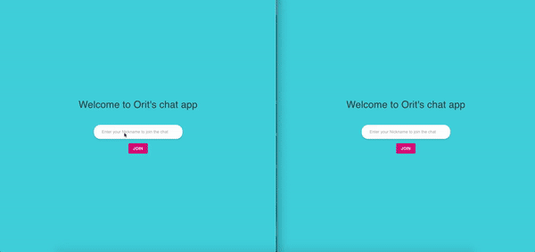
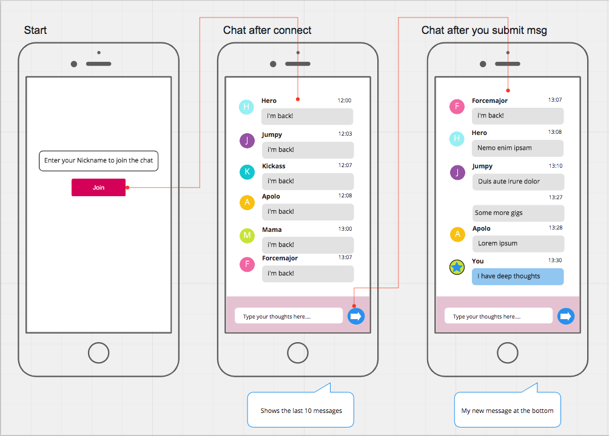
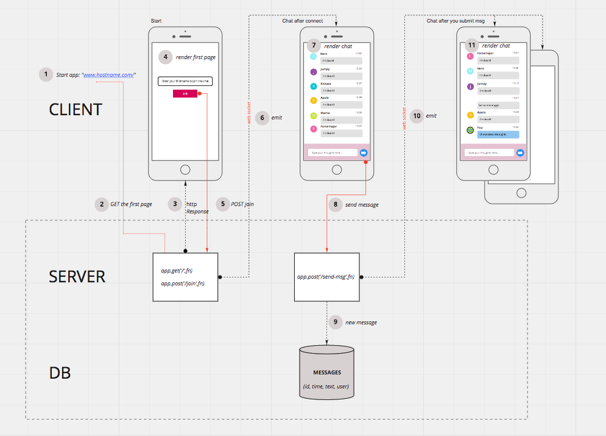

# Chat App - React, Node, MySql



## Created by: Orit Kozolin

<hr>

## App Functional requirenments

<U>Basic functionality </U>

A public chat room where users log in with a nickname and go straight to the chat. They will:

● send messages to the public chat room

● receive new messages in the public chat room while connected

● each user would have an random colored avatar by his message in the chat.

<U>UX/UI </U>

● The design should be responsive and fill the
available screen space (i.e. stretched layout not boxed layout).

● Use Material/Bootstrap

## Flow Design

Take a closer look
[here](https://miro.com/app/board/o9J_kpPhOIM=/)




## Tech Stack

- Client: React + Material UI
- Server: Express (Node)
- DB: MySql with ORM (Sequelize)

<hr>

## Getting Started

### <b>Development mode</b>

```bash
cd server-chat-app
npm run dev
```

The script above will automaticly run both client and server, using the 'concurrently' package. Alternatively you can run them seperatly by the following scripts:

- For the Client

```bash
npm run client
```

- For the Server

```bash
npm start
```

- ports

  Client: http://localhost:3005

  Server: http://localhost:3002
